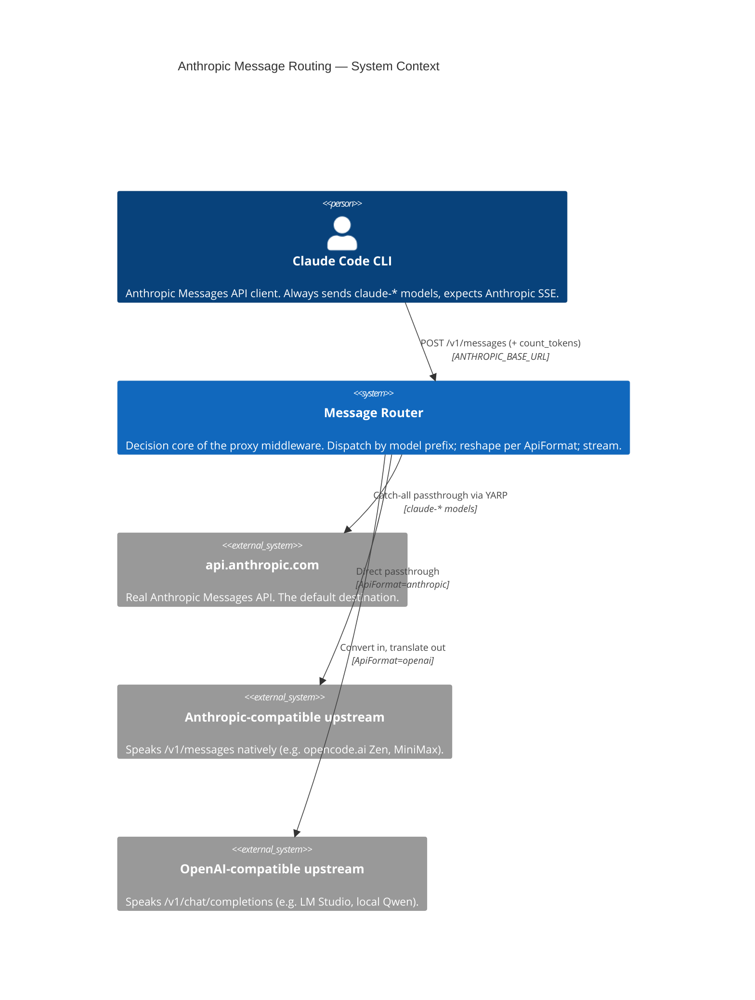

# ANTHROPIC_MESSAGE_ROUTING_HLD_AGENTS.md

AI Context: HLD documentation for the message-routing subsystem of the Smooth Claude Proxy. Updated: 2026-06-14

## TL;DR

This folder specifies how the proxy routes inbound Claude Code requests to one of three destinations and reshapes them to fit. The dispatch primitive is the inbound `model` field: `claude-*` → Anthropic (transparent passthrough via the YARP catch-all); anything else → an alternate upstream reached directly over `HttpClient`. Per-family **default-model overrides** can force a `claude-*` family onto the alternate route. The alternate route has two dialects — `anthropic` (passthrough to `/v1/messages`) and `openai` (convert to `/v1/chat/completions` and translate the reply back to Anthropic SSE). Conversion is **opt-in** (`StripNonClaudeModels`), except for Qwen, which always converts. **Every path streams; buffering is never enabled.** These are LADRs 01–13, all **Accepted**.

This is a spec for spec-driven development. It contains contracts and JSON schemas, not code.

## Non-Negotiables

- **Never buffer the response on any routing path.** Disable response buffering before streaming. A buffered SSE response hangs Claude Code indefinitely with no error. (LADR-10)
- **The default path must stay byte-for-byte transparent.** A real `claude-*` request to Anthropic must be indistinguishable from talking to Anthropic directly — no body rewriting, no header injection beyond what the client sent (minus proxy-only headers). (LADR-01)
- **Only parse the request body when routing is enabled.** Body inspection is gated on `Enabled`. When routing is off, do not read or buffer the body — forward it. (Guiding principle)
- **Model-prefix dispatch is the contract.** `claude-*` means Anthropic unless a per-family override redirects it. Do not introduce content-based, prompt-based, or header-based routing as the primary dispatch — those were tried and removed (see Changelog 2026-06-07). (LADR-02)
- **Do not strip client-supplied `cache_control`.** Forward it untouched on every path. Only *inject* `cache_control` on the `anthropic` passthrough path, and only when none is present anywhere in the body. (LADR-06)
- **A missing response handler is a 501, never a 500.** If the OpenAI-conversion path produces a reply for a model with no registered translator, return an explicit, actionable Anthropic-shaped 501 — do not let a keyed lookup throw. (LADR-08)

## System Context

The router is the decision core of the single forwarding middleware. It sits between Claude Code (a fixed Anthropic Messages API client) and three possible fulfillers. It performs no business logic; it selects a destination, optionally reshapes the request, and optionally translates the reply.

## Architecture Decisions

See [`./ladrs/`](./ladrs/) for the full set. Key decisions an AI coder must internalise before changing routing:

| LADR | Decision | Why it matters |
|------|----------|---------------|
| LADR-01 | Transparent insertion | The proxy is an observer by default. Do not add anything to the Anthropic path that changes the bytes on the wire. |
| LADR-02 | Model-prefix dispatch | `model.StartsWith("claude-")` is the routing primitive. The decision is computed *after* override resolution, so an overridden family is no longer "claude". |
| LADR-03 | Per-family default override | Four families (fable, opus, sonnet, haiku). Match by prefix, swap the `model` field to the override target, and force the alternate route. Empty override = no redirect. |
| LADR-04 | Dual API format | `ApiFormat` ∈ {`anthropic`, `openai`}. `anthropic` = passthrough to `/v1/messages`; `openai` = convert to `/v1/chat/completions`. This is the single switch between the two dialects. |
| LADR-05 | Verbatim-by-default strip gate | `StripNonClaudeModels` off = forward the (still Anthropic-shaped) body verbatim and stream the reply straight back. On = full conversion + slimming + handler translation. **Qwen always converts regardless.** |
| LADR-06 | Prompt-cache injection | On `anthropic` passthrough only: if no `cache_control` anywhere (substring fast-check then structural confirm), append a top-level ephemeral `cache_control`, preserving key order. |
| LADR-07 | `count_tokens` interception | Alternate upstreams have no `count_tokens`. Intercept `*/count_tokens` on the alternate route and return a local estimate so Claude Code can manage its context window. |
| LADR-08 | Keyed response handlers | Response translators are registered per exact model name. No handler → explicit 501. Adding a model = registering a handler (open-closed). |
| LADR-09 | Two-tier config | Immutable `LlmServiceOptions` (startup, from appsettings + env bridge) seeds the mutable `ModelRouteSettings` (runtime, in `IMemoryCache`, tweakable via `/override-model`). |
| LADR-10 | Never buffer | Disable response body buffering on every path before the first write. |
| LADR-11 | Alternate bypasses YARP | The two alternate paths build an `HttpClient` request and stream the response directly. Only the Anthropic path uses YARP's reverse-proxy catch-all. |
| LADR-12 | Anthropic-shaped errors | Upstream unreachable → 502; context overflow → 400; missing handler → 501; other upstream non-2xx → relayed. All client-facing error bodies use the Anthropic error envelope where the client will parse them. |
| LADR-13 | Routing/tracking boundary | Usage tracking (rate-limit capture + DB write) happens only on the Anthropic path and only when no override session is active. Alternate routes never write usage. |

## Key Behaviors

- **Decision order (authoritative):** (1) extract identity + headers; (2) if `Enabled` and body is JSON, parse out `model` and the first user prompt; (3) resolve per-family override — if matched, swap `model` to the override target; (4) compute `routesToAnthropic = model startsWith "claude-"` (post-swap); (5) `isLlmRoute = Enabled AND model present AND (NOT routesToAnthropic OR an override was applied)`; (6) dispatch.
- **Three terminal paths on the alternate route:** `count_tokens` interception (any `ApiFormat`) → local estimate; `ApiFormat=anthropic` → passthrough to `{base}{path}{query}`; `ApiFormat=openai` → `{base}/v1/chat/completions`.
- **Verbatim vs converted (openai path):** `verbatim = NOT StripNonClaudeModels AND NOT isQwen`. Verbatim forwards the body unchanged (except an override model swap) and streams the reply straight back. Converted runs the full Anthropic→OpenAI pipeline and then a per-model response handler.
- **Qwen conversion specifics:** minimal fixed system prompt (Claude Code system blocks discarded); `tool_use`→`tool_calls`, `tool_result`→`tool` role messages; tools slimmed to name/description/params; `tool_choice` forced to `required` when tools present else `none`; `stream=false` (the Qwen handler reads a single JSON body, not SSE) and then re-emits Anthropic SSE.
- **Field slimming (converted path):** drop `model` (rewritten), `budget_tokens`, `thinking`, `metadata`, `context_management`; for Qwen additionally drop inbound `tool_choice`, `system`, `stream`. Strip `<system-reminder>` blocks and other Claude Code infrastructure noise from message text.
- **Auth to alternate upstream:** the alternate route authenticates with the configured upstream token (`Authorization: Bearer` always; plus `x-api-key` and `anthropic-version` on the `anthropic` passthrough). The inbound client token is never forwarded to an alternate upstream.
- **No usage tracking off the Anthropic path:** alternate routes do not capture rate-limit headers and do not write `UserRecord`s.

## Quality Constraints

- **Transparency:** the Anthropic path adds no perceptible latency and no wire-level change. Body parsing is skipped entirely when routing is disabled.
- **Streaming latency:** first SSE byte from any path must flow to the client as soon as the upstream produces it; no full-response buffering. The non-streaming Qwen flow is the deliberate exception (it reads a whole JSON body) and must re-emit SSE incrementally.
- **Long requests:** routing paths must tolerate multi-minute upstream responses (complex prompts). Per-request upstream timeout is generous (10 minutes); do not impose the framework default.
- **Open-closed for upstreams:** adding a new OpenAI-compatible model must require only a new response handler registration and config — no change to the decision core.

## Migration Plans

- **Generalising per-family overrides:** the four families (fable/opus/sonnet/haiku) are enumerated explicitly. If model families proliferate, replace the four-way prefix match with a prefix→override map without changing the decision semantics.
- **Streaming the converted path:** today the converted (Qwen) path is non-streaming upstream then re-emitted as SSE. If a streaming OpenAI-compatible upstream is added, its handler should consume the upstream SSE incrementally rather than buffering — the handler interface already permits it.
- **`ApiFormat` per-model:** `ApiFormat` is global. If a deployment needs anthropic-passthrough for one alternate and openai-conversion for another simultaneously, lift `ApiFormat` (and base URL/token) into a per-destination table. Flag this rather than overloading the single global switch.

## Changelog

| Date | Change | Ref |
|:-----|:-------|:----|
| 2026-06-14 | Created — HLD for the message-routing subsystem (LADRs 01–13, C4 + decision-flow diagrams, reconstruction implementation plan). Reflects the codebase as of the vertical-slice refactor (LADR-005 in the project AGENTS.md). | - |
