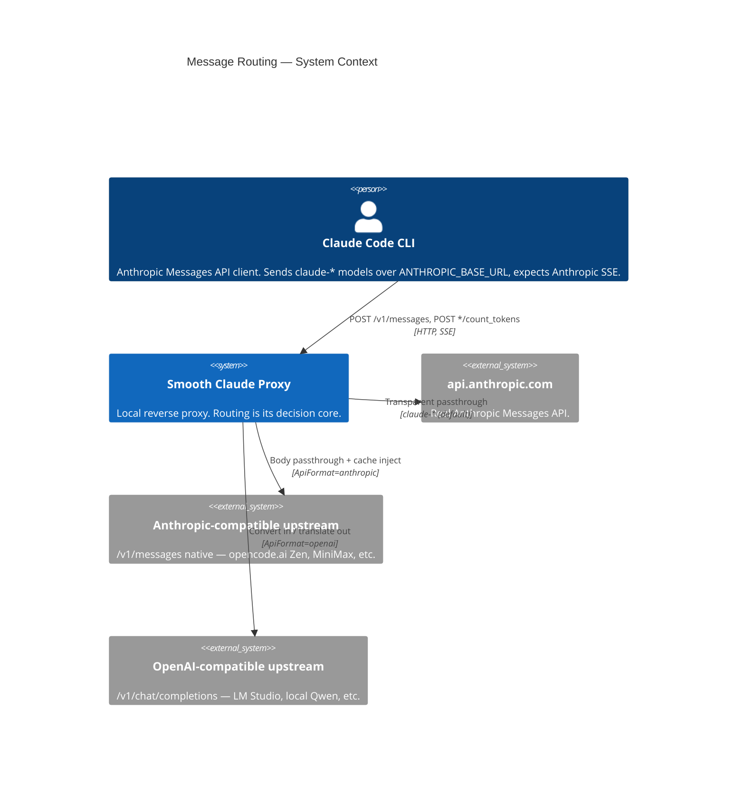

# C4 Containers — Anthropic Message Routing

## System Context

## Container View

The router is not a separate process — it is the decision core *inside* the single forwarding middleware. The boxes below are logical components within that middleware plus the external destinations.

```mermaid
graph TB
    subgraph Client
        CLI["Claude Code CLI<br/><small>Anthropic Messages API</small>"]
    end

    subgraph Proxy["Smooth Claude Proxy (single .NET process)"]
        ID["Identity & Header Extraction<br/><small>auth type, JWT email, x-user-label</small>"]
        DEC["Routing Decision Core<br/><small>parse model + first prompt (if enabled)</small><br/><small>resolve per-family override</small><br/><small>compute isLlmRoute</small>"]
        CFG["Runtime Settings<br/><small>ModelRouteSettings in IMemoryCache</small><br/><small>Enabled · ApiFormat · StripNonClaudeModels · per-family overrides</small>"]
        OPT["Startup Options<br/><small>LlmServiceOptions (appsettings + env bridge)</small><br/><small>BaseUrl · AuthToken · defaults</small>"]

        PASS["Anthropic Passthrough<br/><small>ApiFormat=anthropic</small><br/><small>+ prompt-cache injection</small>"]
        CONV["OpenAI Conversion<br/><small>ApiFormat=openai</small><br/><small>verbatim OR convert+slim</small>"]
        CT["count_tokens Interceptor<br/><small>local estimate</small>"]
        HAND["Keyed Response Handlers<br/><small>per exact model name</small><br/><small>OpenAI reply → Anthropic SSE</small>"]
        YARP["YARP Catch-All<br/><small>{**catch-all} → api.anthropic.com</small>"]
        TRK["Usage Tracking<br/><small>rate-limit capture + Channel write</small>"]
    end

    ANTH["api.anthropic.com"]
    ALTA["Anthropic-compatible upstream"]
    ALTO["OpenAI-compatible upstream"]

    CLI --> ID --> DEC
    OPT -. seeds .-> CFG
    CFG --> DEC

    DEC -->|claude-* & no override| YARP --> ANTH
    YARP -.-> TRK
    DEC -->|alternate, anthropic| PASS --> ALTA
    DEC -->|alternate, openai| CONV --> ALTO
    DEC -->|alternate, */count_tokens| CT
    ALTO --> HAND --> CLI

    style Proxy fill:#0d3b2e,stroke:#00b894,stroke-width:2px
    style Client fill:#0d2a3b,stroke:#4a9eff,stroke-width:2px
    style ANTH fill:#3b1a0d,stroke:#e17055,stroke-width:2px
    style ALTA fill:#3b1a0d,stroke:#e17055,stroke-width:2px
    style ALTO fill:#3b1a0d,stroke:#e17055,stroke-width:2px
```

## Routing-Relevant Inventory

| Component | Responsibility | LADRs |
|-----------|---------------|-------|
| **Identity & Header Extraction** | Reads auth type, JWT email/name (no signature check), `x-user-label`, `anthropic-version`. Strips proxy-only headers before forward. Routing-adjacent — feeds tracking, not dispatch. | 01, 13 |
| **Routing Decision Core** | Parses `model` + first user prompt (only when routing enabled). Resolves per-family override. Computes `routesToAnthropic` and `isLlmRoute`. Selects the terminal path. | 02, 03 |
| **Runtime Settings (`ModelRouteSettings`)** | Mutable routing config in `IMemoryCache`: `Enabled`, `ApiFormat`, `StripNonClaudeModels`, per-family override targets. Tweakable via `/override-model`. | 09 |
| **Startup Options (`LlmServiceOptions`)** | Immutable config bound at startup from appsettings + a well-known env-var bridge. Holds upstream `BaseUrl` + `AuthToken` and seeds the runtime settings. | 09 |
| **Anthropic Passthrough** | `ApiFormat=anthropic`. Forwards body to `{base}{path}{query}` unchanged except optional model swap + prompt-cache injection. Streams SSE back. | 04, 06, 11 |
| **OpenAI Conversion** | `ApiFormat=openai`. Verbatim forward, or full Anthropic→OpenAI convert + slim, to `{base}/v1/chat/completions`. | 04, 05, 11 |
| **`count_tokens` Interceptor** | Returns a local token estimate for alternate routes (upstreams lack the endpoint). | 07 |
| **Keyed Response Handlers** | Per-model translators turning an OpenAI-format reply into Anthropic SSE. Missing handler → 501. | 08 |
| **YARP Catch-All** | `{**catch-all}` → `api.anthropic.com`, 10-min activity timeout, headers preserved. The Anthropic path only. | 01, 11 |
| **Usage Tracking** | Captures rate-limit headers and writes a `UserRecord` via channel — Anthropic non-session path only. | 13 |

## Destination Selection (summary)

| Inbound `model` (after override resolution) | `Enabled` | Path chosen |
|---|---|---|
| `claude-*`, no override applied | any | **Anthropic** (YARP catch-all) |
| `claude-*` family with a non-empty override | `true` | **Alternate** (model swapped to override target) |
| non-`claude-*` | `true` | **Alternate** |
| non-`claude-*` | `false` | **Anthropic** (routing disabled — forward as-is) |
| `*/count_tokens` on an alternate route | `true` | **Local estimate** (short-circuit) |

Within the alternate route, `ApiFormat` chooses passthrough (`anthropic`) vs conversion (`openai`); see [routing-decision-flow.md](./routing-decision-flow.md).
