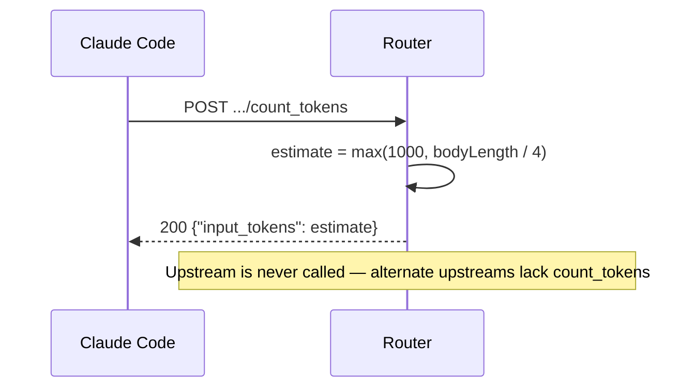
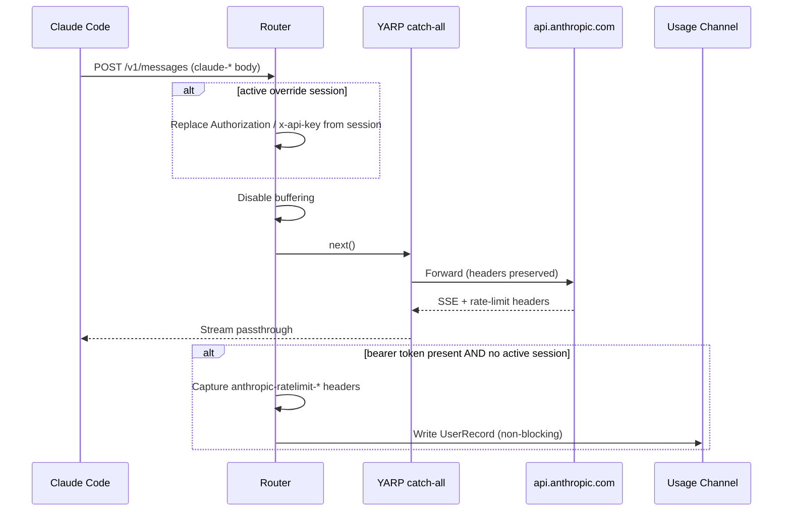

# Routing Decision Flow

This is the authoritative decision tree the router evaluates for every inbound request, followed by a sequence diagram per terminal path. An AI coder should be able to implement the dispatch from this page plus the LADRs.

## Decision Tree

```mermaid
flowchart TD
    A[Inbound request] --> B[Extract identity & headers<br/>strip x-user-label]
    B --> C{Enabled AND<br/>JSON body present?}
    C -->|no| Z[Anthropic path<br/>do not parse body]
    C -->|yes| D[Parse model + first user prompt]
    D --> E{Per-family override<br/>matches model prefix<br/>& override non-empty?}
    E -->|yes| F[model := override target<br/>overrideApplied = true]
    E -->|no| G[overrideApplied = false]
    F --> H
    G --> H[routesToAnthropic =<br/>model startsWith 'claude-']
    H --> I{Enabled AND model present AND<br/>NOT routesToAnthropic OR overrideApplied?}
    I -->|no| Z
    I -->|yes| J{path ends with<br/>count_tokens?}
    J -->|yes| K[Local token estimate<br/>return input_tokens]
    J -->|no| L{ApiFormat?}
    L -->|anthropic| M[Anthropic passthrough path]
    L -->|openai| N{StripNonClaudeModels<br/>OR isQwen?}
    N -->|no| O[Verbatim OpenAI-endpoint forward]
    N -->|yes| P[Convert + slim, then<br/>per-model response handler]

    Z --> Z1[Apply active session auth if set<br/>YARP → api.anthropic.com<br/>capture rate limits + track]

    style Z fill:#1a3b2e,stroke:#00b894
    style Z1 fill:#1a3b2e,stroke:#00b894
    style M fill:#3b2a1a,stroke:#e17055
    style O fill:#3b2a1a,stroke:#e17055
    style P fill:#3b2a1a,stroke:#e17055
    style K fill:#2a1a3b,stroke:#a29bfe
```



### Decision variables (definitions)

| Variable | Definition |
|---|---|
| `Enabled` | `ModelRouteSettings.Enabled` (runtime). Gates body parsing and all alternate routing. |
| `model` | The inbound `model` field, **after** any per-family override swap. |
| `overrideApplied` | True iff a per-family override matched and was non-empty. |
| `routesToAnthropic` | `model` starts with `claude-` (case-insensitive), evaluated on the post-swap `model`. |
| `isLlmRoute` | `Enabled AND model is non-empty AND (NOT routesToAnthropic OR overrideApplied)`. The master switch for the alternate route. |
| `isQwen` | `model` contains `qwen` (case-insensitive). Forces conversion even when `StripNonClaudeModels` is off. |
| `verbatim` | `NOT StripNonClaudeModels AND NOT isQwen`. Within the `openai` path, chooses forward-unchanged vs convert. |

> **Note on override + Anthropic:** because the override swap replaces `model` with a (typically non-`claude`) target *before* `routesToAnthropic` is computed, an overridden family normally yields `routesToAnthropic = false`. The `OR overrideApplied` clause guarantees the alternate route even if the override target itself happens to start with `claude-`.

## Path A — Anthropic passthrough (`ApiFormat=anthropic`)

```mermaid
sequenceDiagram
    participant CLI as Claude Code
    participant R as Router
    participant U as Anthropic-compatible upstream

    CLI->>R: POST /v1/messages (claude-shaped body)
    R->>R: Read body; structural cache_control check
    alt overrideApplied
        R->>R: Swap model field (preserve key order)
    end
    alt no cache_control anywhere
        R->>R: Append top-level cache_control {type: ephemeral}
    end
    R->>R: Disable response buffering
    R->>U: POST {base}{path}{query}<br/>Authorization+x-api-key=upstream token,<br/>anthropic-version, Accept: text/event-stream
    U-->>R: SSE stream
    R-->>CLI: Stream passthrough (unbuffered)
    Note over R: No usage tracking, no DB write
```

## Path B — `count_tokens` interception (any `ApiFormat`)



## Path C — OpenAI verbatim (`ApiFormat=openai`, not stripping, not Qwen)

```mermaid
sequenceDiagram
    participant CLI as Claude Code
    participant R as Router
    participant U as OpenAI-compatible upstream

    CLI->>R: POST /v1/messages (claude-shaped body)
    alt overrideApplied
        R->>R: Swap model field only
    end
    R->>R: Disable buffering; log warning (Anthropic-shape body sent to /v1/chat/completions)
    R->>U: POST {base}/v1/chat/completions (body otherwise unchanged)
    U-->>R: response stream
    R-->>CLI: Stream straight back, untouched
```

## Path D — OpenAI converted (`ApiFormat=openai` + StripNonClaudeModels, or Qwen)

```mermaid
sequenceDiagram
    participant CLI as Claude Code
    participant R as Router
    participant U as OpenAI-compatible upstream
    participant H as Keyed Response Handler

    CLI->>R: POST /v1/messages (claude-shaped body)
    R->>R: Rewrite model; drop unsupported fields;<br/>strip system-reminder/noise; slim tools
    alt isQwen
        R->>R: Minimal system prompt; tool_use→tool_calls;<br/>tool_result→tool role; tool_choice required/none; stream=false
    end
    R->>R: Disable buffering
    R->>U: POST {base}/v1/chat/completions (OpenAI-shaped)
    alt upstream non-2xx
        U-->>R: error body
        R-->>CLI: 400 (context overflow) or relayed status, Anthropic error envelope
    else success
        U-->>R: OpenAI chat completion (single JSON for Qwen)
        R->>H: Resolve handler by exact model name
        alt no handler registered
            R-->>CLI: 501 Anthropic error envelope (actionable)
        else handler present
            H-->>CLI: Anthropic SSE (message_start … content blocks … message_stop)
        end
    end
```

## Path Z — Anthropic via YARP (default / routing disabled)


