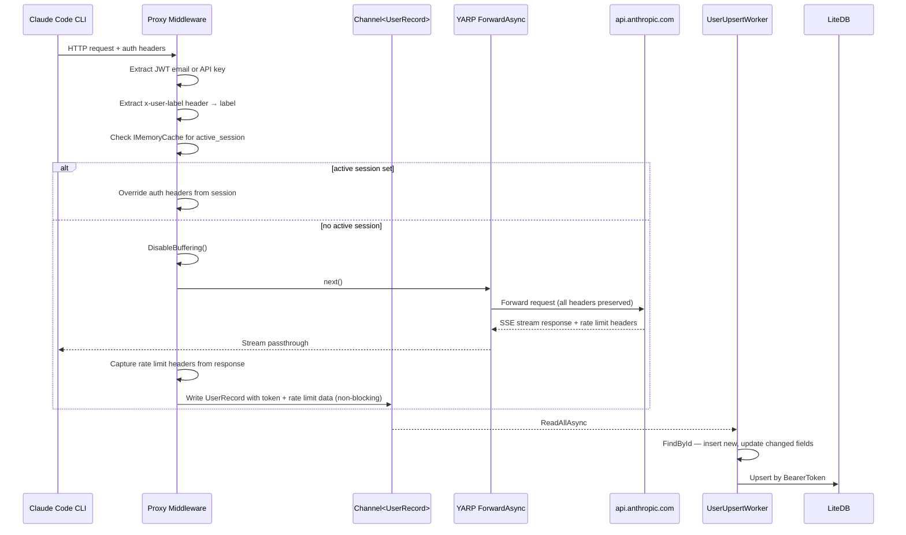

# Claude Code YARP Proxy

## TL;DR

Transparent YARP reverse proxy that sits between Claude Code CLI and `api.anthropic.com`, extracting user identity from auth headers and persisting to LiteDB — response buffering MUST stay disabled or SSE streaming breaks.

## Non-Negotiables

- **Never buffer responses** — `DisableBuffering()` is required. Claude Code uses SSE streaming; buffering will hang the CLI indefinitely with no error.
- **Never validate JWT signatures** — this proxy intentionally does not verify tokens. It only decodes the payload for identity extraction. Adding verification would break the proxy since we don't have Anthropic's signing keys.
- **Never log full tokens** — masked preview only (first 10 + last 10 chars). The `LOG_TOKEN_FORMAT` env var controls debug logging; even when enabled, full tokens must not appear in logs.
- **Never block the request pipeline for DB writes** — all LiteDB operations go through the `Channel<UserRecord>` to the background worker. Synchronous DB access in middleware will add latency to every proxied request.
- **BearerToken is the BsonId** — LiteDB uses `BearerToken` as the primary key (`[BsonId]`). Email is a secondary non-unique index used for lookups. Changing the primary key breaks all existing databases silently (LiteDB won't migrate).

## System Context

The proxy inserts itself in the Claude Code network path. Claude Code CLI supports `ANTHROPIC_BASE_URL` to redirect all API traffic.

## Architecture Decisions

### LADR-001 — Unbounded Channel for DB Writes

- **Date**: 2026-03-13
- **Status**: Accepted
- **Context**: DB writes in request middleware add ~2-5ms latency per request. With streaming responses, any delay is perceptible.
- **Decision**: Use `Channel.CreateUnbounded<UserRecord>` with a single-reader `BackgroundService` to decouple DB writes from the request pipeline.
- **Consequences**: Zero request latency impact. Trade-off: unbounded queue can grow if LiteDB locks up — acceptable for a local dev tool with low request volume. If this ever runs multi-tenant at scale, switch to `CreateBounded` with a drop policy.

### LADR-002 — Manual JWT Decode Over Library

- **Date**: 2026-03-13
- **Status**: Accepted
- **Context**: `System.IdentityModel.Tokens.Jwt` requires signature validation config and adds ~2MB to publish size. Claude Code's token format may be JWT or opaque — we only need the payload claims.
- **Decision**: Manual base64 decode of JWT part[1] with graceful fallback. No signature verification.
- **Consequences**: Works for both JWT and opaque tokens (opaque silently returns null). Cannot detect expired or tampered tokens — acceptable since we're not an auth boundary, just an observer.

### LADR-003 — Single Program.cs Top-Level Statements

- **Date**: 2026-03-13
- **Status**: Superseded by LADR-005 (2026-06-14)
- **Context**: The proxy has exactly two concerns: middleware extraction and background DB writes.
- **Decision**: Keep everything in `Program.cs` with `UserRecord`, `UserUpsertWorker`, `ActiveSession`, `LabelRequest`, and `AppJsonContext` as the only separate types. No service layer, no repository pattern.
- **Consequences**: Fast to read and modify. Grew to ~1789 lines — well past the threshold — which is what prompted LADR-005.

### LADR-005 — Vertical Slice / Feature Folders

- **Date**: 2026-06-14
- **Status**: Accepted
- **Context**: `Program.cs` reached 1789 lines mixing every concern (auth extraction, model routing, LLM conversion, user tracking, endpoints, DTOs). Editing one feature meant scrolling past all others.
- **Decision**: Organize code by feature under `Features/<Feature>/` (one namespace per feature, `SmoothClaudeProxy.Features.<Feature>`), with cross-cutting setup under `Infrastructure/`. Each feature owns its types, helpers, endpoint group (`Map<Feature>Endpoints` extension), and DI registration (`Add<Feature>` extension). The core request pipeline moved to `Features/Proxy/ProxyForwardingMiddleware.cs` as an `IMiddleware`. `Program.cs` is now an ~83-line composition root.
- **Feature map**: `Proxy` (forwarding middleware, JWT identity, health) · `ModelRouting` (LlmServiceOptions, ModelRouteSettings/Request, override resolver, request filter, response handlers, `/override-model`) · `Logins` (UserRecord, UserUpsertWorker, `/logins`) · `Sessions` (ActiveSession, `/override`) · `Usage` (`/current`, `/usage`) · `Infrastructure` (Serilog setup, AppJsonContext).
- **Consequences**: Each feature is editable in isolation; the composition root reads top-to-bottom. Cross-feature references use explicit `using` directives (no global usings). Behavior is unchanged — startup config, env-var overrides, runtime `/override-model` mutation, and the LLM-routing branches all verified post-refactor.

### LADR-004 — Port 5066

- **Date**: 2026-03-13
- **Status**: Accepted
- **Context**: Default port 5000 conflicts with macOS AirPlay Receiver (introduced in macOS Monterey). A deterministic, memorable port was needed that avoids well-known assignments (e.g. 5060/5061 SIP, 5432 Postgres, 5672 AMQP).
- **Decision**: Use port 5066, derived as `sum("claudekeys" ASCII values) mod 1000 + 5000` → `1066 mod 1000 + 5000 = 66 + 5000 = 5066`. Port 5066 has no IANA-assigned service, is not blocked by common firewalls, and its origin is reproducible from the project name.
- **Consequences**: No conflict with macOS system services. Port is project-specific and self-documenting. Docker `EXPOSE`, `ASPNETCORE_URLS`, and compose mappings must all use 5066.

## Key Behaviors

- **Auth detection order**: `x-api-key` is captured first (`authType = "API-Key"`), then `Authorization` header overwrites `authType` to `"Bearer"`. If both are present, `authType` is "Bearer" but `apiKey` is still captured from `x-api-key`.
- **JWT claim fallback**: Extracts `email` claim, then `name` claim (for future use), falling back to `sub` if no `name`. If the token isn't a JWT (opaque OAuth token), decode fails silently.
- **Failed JWT logging exposure**: When email extraction fails, the full JWT claims JSON is logged at Information level. This may include sensitive claims. Only happens for decodable JWTs with no `email` claim.
- **`x-user-label` header**: If present, its value becomes the `Label` for the token. The header is stripped before forwarding to Anthropic — it's proxy-only metadata.
- **Rate limit header capture**: After each proxied response, `anthropic-ratelimit-input-tokens-remaining`, `anthropic-ratelimit-output-tokens-remaining`, `anthropic-ratelimit-input-tokens-reset`, and `anthropic-ratelimit-output-tokens-reset` are read and persisted with the `UserRecord`. Values are stored as `long` (rounded from the header's double string).
- **Token-based dedup**: Primary key is `BearerToken`. Each new token gets one DB record. No email-based dedup or stale token deletion currently — one token → one record at rest.
- **Override session**: `POST /override/{identifier}` loads a user's credentials from LiteDB into `IMemoryCache`, resolved by `Email` or `Label`. All subsequent proxied requests use those credentials (auth headers replaced) and skip DB writes. `DELETE /override` returns to pass-through mode.
- **Model routing to alternate upstream**: Requests where the `model` field does not start with `claude-` are forwarded to an alternate upstream (default: OpenCode Go at `https://opencode.ai/zen/go`) instead of Anthropic. The request body is forwarded verbatim with no model rewriting. Controlled via `IMemoryCache`-backed `ModelRouteSettings` (defaults: `Enabled=true`, `ApiFormat="anthropic"`). The target URL comes from `LLMSERVICE_BASEURL` (falling back to the legacy `LMSTUDIO_BASE_URL`), and auth comes from `LLMSERVICE_API_KEY` (falling back to the legacy `OPENCODE_API_KEY`) — in each pair the `LLMSERVICE_*` var wins when both are set. Both bridge onto `LlmService:BaseUrl` / `LlmService:AuthToken`, overriding appsettings. These requests bypass YARP entirely — HttpClient streams the response directly. No DB writes or rate-limit capture for non-Claude requests. Settings are changeable at runtime via `/override-model` endpoints.
- **Prompt cache injection on anthropic passthrough**: In the Anthropic-native passthrough path (`ApiFormat="anthropic"`), if the request body contains no actual `cache_control` property (substring scan is only a fast negative check; positives are confirmed by a recursive structural search of the parsed JSON, so prompt text that merely mentions `cache_control` doesn't suppress injection), a top-level `cache_control: {"type":"ephemeral"}` is appended after the original properties (key order preserved) so anthropic-compatible upstreams (e.g. MiniMax, opencode.ai) enable prompt caching automatically. Non-object JSON bodies (arrays, scalars) are forwarded unchanged. Client-supplied `cache_control` (block-level or top-level) is always forwarded untouched — including in the OpenAI-format conversion path, which no longer strips it.
- **Strip gate for non-Claude models**: `LlmService:StripNonClaudeModels` (appsettings, default `false`) gates request preprocessing in the OpenAI-format path (`ApiFormat="openai"`). Off (default): the request body is forwarded byte-for-byte to `/v1/chat/completions` (still Anthropic-shaped — a Warning is logged; strict OpenAI upstreams may reject it) and the response is streamed straight back untouched. On: the full Anthropic→OpenAI conversion + slimming pipeline runs and the model-specific response handler translates the reply. Exception: Qwen models ALWAYS run the conversion pipeline regardless of the setting, because `Qwen2_5ResponseHandler` requires the converted non-stream JSON flow. Toggleable at runtime via `POST /override-model` (`StripNonClaudeModels`). The anthropic passthrough path is unaffected by this setting.
- **Channel write gated on active session**: When an active session is set, the channel write is skipped entirely — no DB record is updated for proxied requests in session mode.
- **YARP catch-all route**: `{**catch-all}` matches everything — but `MapGet`/`MapPost`/`MapDelete`/`MapPatch` endpoints are registered before `MapReverseProxy()`, so they take precedence. Order matters.
- **10-minute activity timeout**: YARP's `ActivityTimeout` is set to 10 minutes for long-running Claude requests. Default (100s) will kill streaming responses for complex prompts.
- **Docker volume**: LiteDB and logs share the same volume mount at `/data`. The `WORKSPACE_PATH` env var controls the container-side path; `CLAUDE_PROXY_DIR` controls the host-side bind mount in compose.
- **Rolling logs**: 7-day retention (`retainedFileCountLimit: 7`). Log files roll daily.
- **Non-2xx warning**: Any upstream response with status ≥ 400 logs a `Warning` reminding the operator to check that the proxy is running and the key is valid.
- **OpenAPI docs**: Scalar UI is served at `/scalar/v1` (via `MapScalarApiReference`). Raw OpenAPI spec at `/openapi/v1.json`.

## API Endpoints

| Method | Path | Description |
|:-------|:-----|:------------|
| `GET` | `/health` | Returns `{"status":"ok","target":"https://api.anthropic.com"}` |
| `GET` | `/logins` | Lists all tracked keys with masked token, label, rate limit remaining, and last used |
| `GET` | `/logins/{identifier}/token` | Returns the full token for a tracked login, resolved by exact token, email, or label |
| `PATCH` | `/logins/{bearerToken}/label` | Assigns a friendly name (`Label`) to a tracked bearer token |
| `POST` | `/override/{identifier}` | Activates a session by email or label; subsequent requests proxy as that user |
| `GET` | `/override` | Returns current override session (token masked), or 404 |
| `DELETE` | `/override` | Clears override session; proxy returns to pass-through mode |
| `GET` | `/override-model` | Returns current model routing settings |
| `POST` | `/override-model` | Updates model routing: `Enabled`, `ApiFormat`, `StripNonClaudeModels` |
| `DELETE` | `/override-model` | Resets model routing to defaults (enabled, apiFormat=anthropic) |
| `GET` | `/openapi/v1.json` | OpenAPI spec |
| `GET` | `/scalar/v1` | Scalar interactive API docs UI |

## Quality Constraints

- **Startup time**: Target sub-2s cold start. Published with ReadyToRun. Do not add heavy DI containers or startup initialization that scans assemblies.
- **Request overhead**: Middleware must add <1ms to request latency. All IO (DB, heavy logging) must be async and off the hot path.

## Migration Plans

- **Dockerfile target mismatch**: Docker images must match the `TargetFramework` in csproj. Currently aligned at net10.0.
- **LiteDB AOT incompatibility**: LiteDB uses reflection-heavy BsonMapper. If native AOT is needed in the future, replace with SQLite + Dapper or raw `Microsoft.Data.Sqlite`. Do not attempt `PublishAot=true` with LiteDB — it will compile but fail at runtime with missing metadata.
- **PublishTrimmed removed**: `TrimMode=partial` strips `JsonTypeInfo` metadata for endpoint return types (`List<UserRecord>` etc.), causing 500s on all `MapGet` endpoints. The ASP.NET Core Request Delegate Generator emits trimming-incompatible serialization code. `PublishReadyToRun=true` is retained for startup speed.
- **Token format uncertainty**: Claude Code's auth token may not be a JWT. If Anthropic changes to opaque tokens, the JWT decode path returns null gracefully. The `LOG_TOKEN_FORMAT=true` env var exists specifically to diagnose token format changes.
- **Program.cs extraction**: Done (LADR-005, 2026-06-14). The middleware now lives in `Features/Proxy/ProxyForwardingMiddleware.cs` and all features are sliced into `Features/<Feature>/`; `Program.cs` is an ~83-line composition root.

## Changelog

| Date | Change | Ref |
|:-----|:-------|:----|
| 2026-03-13 | Created — initial proxy with YARP, LiteDB, Serilog, Docker support | - |
| 2026-03-13 | Added override session API (`POST/GET/DELETE /override`) backed by `IMemoryCache` | - |
| 2026-03-13 | Auth header override from session; channel write skipped when session active | - |
| 2026-03-13 | `BearerToken` is primary key (`[BsonId]`); email is secondary index only | - |
| 2026-03-13 | `x-user-label` header support — sets `Label`, stripped before forwarding | - |
| 2026-03-13 | Rate limit header capture — unified utilization and reset timestamps persisted per token | - |
| 2026-03-13 | `PATCH /logins/{bearerToken}/label` endpoint for token labeling | - |
| 2026-03-13 | `POST /override/{identifier}` resolves by email or label | - |
| 2026-03-13 | OpenAPI docs via Scalar; `/openapi/v1.json` and `/scalar/v1` | - |
| 2026-03-13 | Warning log on non-2xx upstream responses with proxy hint | - |
| 2026-03-13 | 7-day rolling log retention | - |
| 2026-03-13 | Removed `Name` field from UserRecord and responses; kept `Label` from fake name generation | - |
| 2026-03-13 | Renamed `/users` endpoints to `/logins` | - |
| 2026-03-14 | Route haiku models to local LM Studio via `LMSTUDIO_BASE_URL` with runtime settings | - |
| 2026-03-14 | `/override-model` API for runtime model routing config (enabled, fromModel, toModel) | - |
| 2026-06-07 | Simplified model routing: removed `FromModel`, `FromPrompt`, `ToModel` fields; routing now based solely on model prefix (claude-* → Anthropic, others → alternate upstream); model field forwarded verbatim with no rewriting | - |
| 2026-06-07 | Added Anthropic-native passthrough mode (`ApiFormat="anthropic"`) for opencode.ai and compatible upstreams | - |
| 2026-06-12 | Prompt caching: inject top-level `cache_control` (ephemeral) on anthropic passthrough when absent; stopped stripping client `cache_control` in OpenAI-format conversion | - |
| 2026-06-12 | Added `StripNonClaudeModels` setting (appsettings + `/override-model`, default off): off = OpenAI-path body forwarded byte-for-byte (no conversion or filtering at all); on = full Anthropic→OpenAI conversion + slimming pipeline | - |
| 2026-06-12 | Review fixes: structural `cache_control` detection (appended, key order preserved, non-object guard); Qwen always converts regardless of strip gate; verbatim mode streams response straight back instead of resolving Qwen-only handler; explicit `application/json` (no charset) on passthrough/verbatim content; `DELETE /override-model` response includes `StripNonClaudeModels`; removed unreachable kebab-case config fallback | - |
| 2026-06-13 | Added `GET /logins/{identifier}/token` to return an unmasked tracked token, resolved by exact token, email, or label | - |
| 2026-06-14 | Bound `LlmService` settings via the Options pattern (`LlmServiceOptions`, env-var bridge, internal setters) instead of manual `GetValue<>`/`GetEnvironmentVariable` resolution | - |
| 2026-06-14 | Refactored into vertical feature slices (`Features/<Feature>/` + `Infrastructure/`); `Program.cs` reduced from 1789 to ~83 lines (LADR-005) | - |
| 2026-06-14 | Provider-agnostic env vars `LLMSERVICE_API_KEY` / `LLMSERVICE_BASEURL` now bridge onto `LlmService:AuthToken` / `LlmService:BaseUrl` and take precedence over the legacy `OPENCODE_API_KEY` / `LMSTUDIO_BASE_URL` | - |
