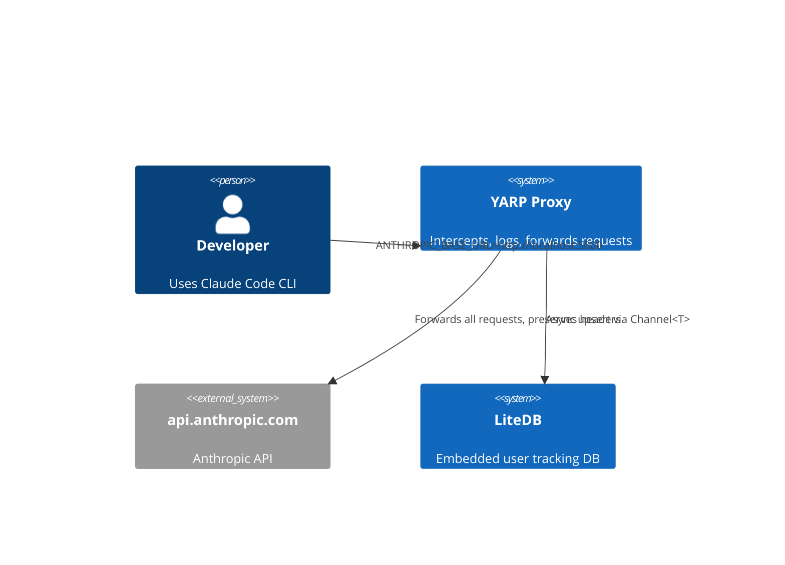
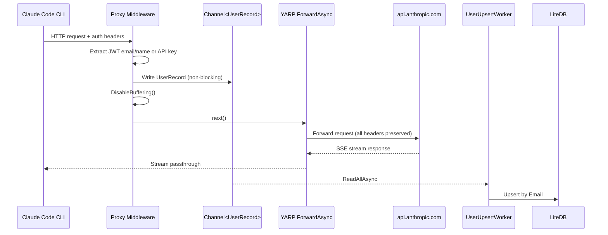

# Claude Code YARP Proxy

## TL;DR

Transparent YARP reverse proxy that sits between Claude Code CLI and `api.anthropic.com`, extracting user identity from auth headers and persisting to LiteDB — response buffering MUST stay disabled or SSE streaming breaks.

## Non-Negotiables

- **Never buffer responses** — `DisableBuffering()` is required. Claude Code uses SSE streaming; buffering will hang the CLI indefinitely with no error.
- **Never validate JWT signatures** — this proxy intentionally does not verify tokens. It only decodes the payload for identity extraction. Adding verification would break the proxy since we don't have Anthropic's signing keys.
- **Never log full tokens** — masked preview only (first 10 + last 10 chars). The `LOG_TOKEN_FORMAT` env var controls debug logging; even when enabled, full tokens must not appear in logs.
- **Never block the request pipeline for DB writes** — all LiteDB operations go through the `Channel<UserRecord>` to the background worker. Synchronous DB access in middleware will add latency to every proxied request.
- **Email is the BsonId** — LiteDB uses `Email` as the primary key. Changing this breaks all existing databases silently (LiteDB won't migrate).

## System Context

The proxy inserts itself in the Claude Code network path. Claude Code CLI supports `ANTHROPIC_BASE_URL` to redirect all API traffic.

## Architecture Decisions

### LADR-001 — Unbounded Channel for DB Writes

- **Date**: 2026-03-13
- **Status**: Accepted
- **Context**: DB writes in request middleware add ~2-5ms latency per request. With streaming responses, any delay is perceptible.
- **Decision**: Use `Channel.CreateUnbounded<UserRecord>` with a single-reader `BackgroundService` to decouple DB writes from the request pipeline.
- **Consequences**: Zero request latency impact. Trade-off: unbounded queue can grow if LiteDB locks up — acceptable for a local dev tool with low request volume. If this ever runs multi-tenant at scale, switch to `CreateBounded` with a drop policy.

### LADR-002 — Manual JWT Decode Over Library

- **Date**: 2026-03-13
- **Status**: Accepted
- **Context**: `System.IdentityModel.Tokens.Jwt` requires signature validation config and adds ~2MB to publish size. Claude Code's token format may be JWT or opaque — we only need the payload claims.
- **Decision**: Manual base64 decode of JWT part[1] with graceful fallback. No signature verification.
- **Consequences**: Works for both JWT and opaque tokens (opaque silently returns null). Cannot detect expired or tampered tokens — acceptable since we're not an auth boundary, just an observer.

### LADR-003 — Single Program.cs Top-Level Statements

- **Date**: 2026-03-13
- **Status**: Accepted
- **Context**: The proxy has exactly two concerns: middleware extraction and background DB writes.
- **Decision**: Keep everything in `Program.cs` with `UserRecord` and `UserUpsertWorker` as the only separate types. No service layer, no repository pattern.
- **Consequences**: Fast to read and modify. If scope grows beyond ~300 lines, extract middleware into a separate class.

### LADR-004 — Port 5066

- **Date**: 2026-03-13
- **Status**: Accepted
- **Context**: Default port 5000 conflicts with macOS AirPlay Receiver (introduced in macOS Monterey). A deterministic, memorable port was needed that avoids well-known assignments (e.g. 5060/5061 SIP, 5432 Postgres, 5672 AMQP).
- **Decision**: Use port 5066, derived as `sum("claudekeys" ASCII values) mod 1000 + 5000` → `1066 mod 1000 + 5000 = 66 + 5000 = 5066`. Port 5066 has no IANA-assigned service, is not blocked by common firewalls, and its origin is reproducible from the project name.
- **Consequences**: No conflict with macOS system services. Port is project-specific and self-documenting. Docker `EXPOSE`, `ASPNETCORE_URLS`, and compose mappings must all use 5066.

## Key Behaviors

- **Auth detection order**: Bearer token checked after API key. If both present, `authType` is "Bearer" (last write wins) but `apiKey` is still captured from `x-api-key`.
- **JWT claim fallback**: Extracts `email` claim, then `name` claim, falling back to `sub` if no `name`. If the token isn't a JWT (opaque OAuth token), decode fails silently and user is logged as "unknown".
- **Failed JWT logging exposure**: When email extraction fails, the full JWT claims JSON is logged at Information level. This may include sensitive claims. Only happens for malformed JWTs with decodable payloads but no email claim.
- **YARP catch-all route**: `{**catch-all}` matches everything including `/health` and `/users` — but `MapGet` endpoints are registered before `MapReverseProxy()`, so they take precedence. Order matters.
- **10-minute activity timeout**: YARP's `ActivityTimeout` is set to 10 minutes for long-running Claude requests. Default (100s) will kill streaming responses for complex prompts.
- **Docker volume**: LiteDB and logs share the same volume mount at `/data`. The `WORKSPACE_PATH` env var controls the container-side path; `CLAUDE_PROXY_DIR` controls the host-side bind mount in compose.

## Quality Constraints

- **Startup time**: Target sub-2s cold start. Published with ReadyToRun + trimming. Do not add heavy DI containers or startup initialization that scans assemblies.
- **Request overhead**: Middleware must add <1ms to request latency. All IO (DB, heavy logging) must be async and off the hot path.

## Migration Plans

- **Dockerfile target mismatch**: Docker images must match the `TargetFramework` in csproj. Currently aligned at net10.0.
- **LiteDB AOT incompatibility**: LiteDB uses reflection-heavy BsonMapper. If native AOT is needed in the future, replace with SQLite + Dapper or raw `Microsoft.Data.Sqlite`. Do not attempt `PublishAot=true` with LiteDB — it will compile but fail at runtime with missing metadata.
- **Token format uncertainty**: Claude Code's auth token may not be a JWT. If Anthropic changes to opaque tokens, the JWT decode path returns null gracefully. The `LOG_TOKEN_FORMAT=true` env var exists specifically to diagnose token format changes.

## Changelog

| Date | Change | Ref |
|:-----|:-------|:----|
| 2026-03-13 | Created — initial proxy with YARP, LiteDB, Serilog, Docker support | - |
